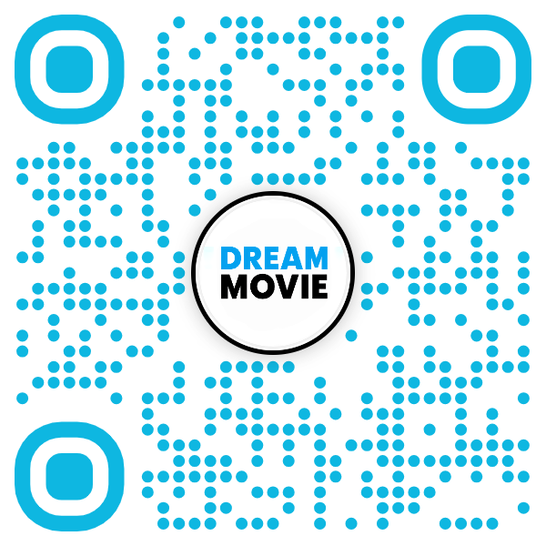

# 🎬 Dream Movie

<p align="center">
  
  
  
  
</p>

Plataforma web de cine para **explorar cartelera**, **comprar entradas paso a paso**, seleccionar butacas y gestionar la experiencia de compra con una interfaz moderna.

---

## ✨ Características principales

- 🏠 **Inicio visual atractivo** con carrusel y secciones de películas destacadas.
- 🎟️ **Flujo de compra guiado en 6 pasos** (cine, fecha, película, sala/hora, entradas, pago).
- 🪑 **Selección de butacas** con disponibilidad y estado visual.
- 🧾 **Resumen de compra** antes de confirmar el pago.
- 📧 **Preparado para notificaciones por correo** (PHPMailer).
- 🔳 **Generación de QR** para tickets digitales.
- 🖨️ **Soporte de PDF** para comprobantes/reportes.

---

## 🧱 Stack tecnológico

| Capa | Tecnologías |
|---|---|
| Backend | PHP |
| Frontend | HTML, CSS, Bootstrap 5, Bootstrap Icons, AOS |
| Librerías PHP | `dompdf/dompdf`, `chillerlan/php-qrcode`, `phpmailer/phpmailer`, `tecnickcom/tcpdf` |
| Dependencias | Composer |
| Diagramación | PlantUML (Diagramas C4) |

---

## 📁 Estructura del proyecto

```text
DreamMovie/
├── views/                 # Vistas principales y endpoints AJAX
│   ├── index.php
│   ├── cartelera.php
│   ├── comprar.php
│   ├── promociones.php
│   ├── salas.php
│   ├── assets/            # Recursos estáticos del frontend
│   │   ├── css/
│   │   ├── js/
│   │   ├── img/
│   │   └── icons/
│   ├── ajax_get_*.php
│   └── includes/          # Componentes PHP reutilizables (header, nav, conexión, etc.)
├── DiagramasC4/           # Diagramas de arquitectura C4
├── vendor/                # Dependencias instaladas por Composer
├── composer.json
└── README.md
```

---

## 🚀 Puesta en marcha rápida

### 1) Requisitos

- PHP 8.x
- Composer 2.x
- Servidor web local (Apache/Nginx o `php -S`)
- Base de datos MySQL/MariaDB (según configuración de `views/includes/conexion.php`)

### 2) Instalar dependencias

```bash
composer install
```

### 3) Configurar conexión a base de datos

Asegúrate de que el archivo de conexión tenga las credenciales correctas:

- Host
- Usuario
- Contraseña
- Base de datos

### 4) Ejecutar en local

Ejemplo rápido con servidor embebido de PHP:

```bash
php -S localhost:8000 -t views
```

Luego abre en tu navegador:

```text
http://localhost:8000/index.php
```

---

## 📱 Experiencia responsiva + acceso móvil rápido

Dream Movie está diseñado con un enfoque **responsive**, por lo que la interfaz se adapta a computadoras, tablets y celulares para mantener una navegación clara y un flujo de compra cómodo en cualquier tamaño de pantalla.

Si quieres abrir el proyecto rápidamente desde tu teléfono durante pruebas locales o demos, escanea este QR:

<p align="center">
  
</p>

---

## 🧭 Módulos principales

- **`index.php`**: landing principal con cartelera semanal y próximos estrenos.
- **`cartelera.php`**: vista completa de cartelera.
- **`comprar.php`**: proceso completo de compra de entradas con pasos guiados.
- **`ajax_get_*.php`**: endpoints para cargar datos dinámicos (películas, salas, horarios, asientos ocupados).
- **`promociones.php`**: vista de beneficios y promociones.
- **`salas.php`**: información de salas disponibles.

---

## 🧩 Dependencias relevantes

El proyecto usa estas librerías desde Composer:

- `dompdf/dompdf`
- `chillerlan/php-qrcode`
- `phpmailer/phpmailer`
- `tecnickcom/tcpdf`

---

## 🏗️ Arquitectura (C4)

En la carpeta `DiagramasC4/` encontrarás:

- `contexto.puml`
- `contenedores.puml`
- `componentes.puml`
- `codigo.puml`

Puedes renderizarlos con PlantUML para documentar y comunicar el diseño del sistema.

---

## 🔒 Notas de seguridad (recomendado)

Para ambientes reales, se recomienda:

- Validar y sanear todos los datos de entrada.
- Proteger credenciales y no versionarlas en texto plano.
- Aplicar prepared statements en consultas SQL.
- Añadir protección CSRF en formularios.
- Cifrar o tokenizar información sensible de pago.

---

## 🛣️ Roadmap sugerido

- [ ] Separar lógica de negocio del código de vistas.
- [ ] Incorporar autenticación de usuarios.
- [ ] Añadir panel administrativo (películas, salas, funciones).
- [ ] Implementar pruebas automáticas básicas.
- [ ] Contenerización con Docker.

---

<p align="center"><b>Hecho con 🎥 + ☕ para mejorar la experiencia de compra en cines.</b></p>
